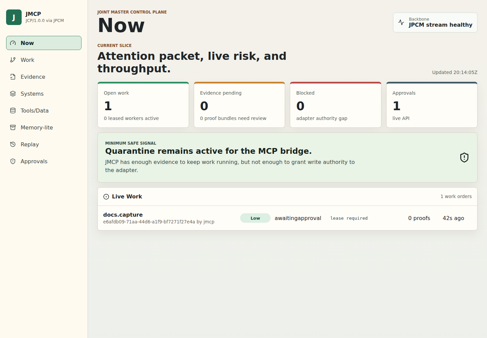
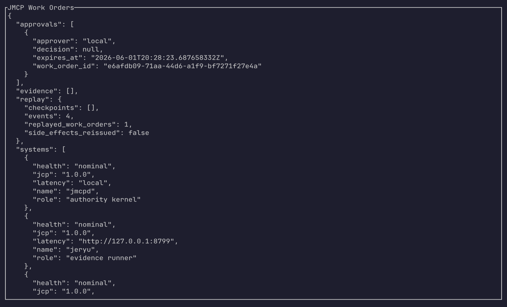

# JMCP

JMCP is the Joint Master Control Plane. JCP/1.0.0 is the protocol, and JPCM is
the replayable transport/profile layer. This repository contains the local V1
runtime: Rust authority API, SQLite event store, CLI, Rust TUI, React cockpit,
Telegram intake/approvals, and local adapter boundaries for Jankurai, Jeryu,
Jailgun, and Jekko.

## Operator Surfaces

### Web Cockpit

The cockpit is the primary visual dashboard for work orders, approvals, evidence,
systems, replay, and the Jeryu ecosystem graph.



### Rust TUI

The Rust TUI is the terminal recovery and inspection surface. It reads the same
JMCP API projections as the cockpit.



The TUI screenshot above was captured with `tuiwright` from the Jankurai
toolchain against a local JMCP API.

## Run Locally

Start the API on the safe JMCP default port:

```bash
cargo run -p jmcpd -- --database jmcp.db --listen 127.0.0.1:18877
```

Start the cockpit on the safe cockpit default port:

```bash
VITE_JMCP_API_URL=http://127.0.0.1:18877 npm --workspace @jmcp/cockpit run dev -- --host 127.0.0.1 --port 15873
```

Inspect from the CLI:

```bash
cargo run -p jmcpctl -- health
cargo run -p jmcpctl -- submit tenant/jmcp/demo docs.capture --payload '{"objective":"demo"}'
cargo run -p jmcpctl -- work-orders
cargo run -p jmcpctl -- evidence
cargo run -p jmcpctl -- replay
cargo run -p jmcpctl -- ecosystem
```

Inspect from the TUI:

```bash
cargo run -p jmcp-tui -- --once
```

JMCP defaults must not bind Jeryu protected ports. Keep JMCP API on
`127.0.0.1:18877` and cockpit on `127.0.0.1:15873` unless those ports are
already occupied.

## Agent-Readable Docs

Use these docs as the durable review surface before changing governance,
contracts, adapters, data truth, release gates, or generated artifacts:

- [Architecture](docs/architecture.md): runtime authority, event model,
  approvals, and failure classes.
- [Boundaries](docs/boundaries.md): Rust, SQL, protocol, UI, and adapter
  ownership rules.
- [Generated zones](docs/generated-zones.md): generated artifact rules and
  contract-drift receipts.
- [Testing](docs/testing.md): local proof lanes, adversarial fixtures, and
  release gate coverage.
- [Security](docs/security.md): secrets, approvals, replay safety, and supply
  chain evidence.
- [Release gate](docs/release.md) and
  [release process doc](docs/release-process.md): version source, changelog,
  proof artifacts, integrity/provenance evidence, and rollback.
- [Audit rubric](docs/audit-rubric.md): Jankurai rule routing and finding
  remediation expectations.

## Jailgun Adapter

JMCP submits `jailgun.run`, `jailgun.capture`, and `jailgun.deploy` work orders
to Jailgun over HTTP with `POST /api/runs`. Configure the client explicitly:

```dotenv
JMCP_JAILGUN_URL=http://127.0.0.1:8787
JMCP_JAILGUN_ALLOWED_URLS=http://127.0.0.1:8787
JMCP_JAILGUN_TOKEN=redacted
JMCP_JAILGUN_BIN=jailgun
```

`JMCP_JAILGUN_TOKEN` is forwarded as `x-jailgun-token`. `JMCP_JAILGUN_URL` must
match one configured local submission policy entry exactly after trailing slash
normalization. `JMCP_JAILGUN_BIN` is only for the current `jailgun.review_packet`
CLI path.

Run-agent work orders should carry the canonical inline shape:

```json
{
  "request": {
    "version": 1,
    "prompt_ref": "jmcp://work-orders/example/prompt",
    "prompt_file": "/path/to/prompt.txt"
  }
}
```

`request_path` remains accepted for compatibility callers and is read into the
same HTTP JSON body. Jailgun run requests, review-packet requests, summaries,
and review packets must all use `version: 1`; other versions fail closed.

The Jekko ZYAL runner in `jmcp-adapter-jekko` submits only to
`jekko port-run`; it does not invoke the Jailgun CLI. Jailgun work orders stay
behind `jmcp-adapter-jailgun`, where `run-agent` uses HTTP and
`review-packet` remains the bounded CLI compatibility path.

## Autonomous Actions

JMCP exposes a small full-auto catalog for bounded, evidence-oriented ZYAL work
orders:

- `GET /autonomous-actions`
- `POST /autonomous-actions/:id/submit`

The initial actions are committed under `agent/zyal/*.zyal` and submit
`zyal.run` work orders through the normal signed JCP envelope path with
`live=false`, fixed stage/time caps, and `submitted_by: "jmcp.full_auto"`
metadata. They do not bypass leases, evidence recording, replay, approvals, or
adapter health tracking.

## Telegram

Keep Telegram secrets in `telegram.env`; do not commit or print the bot token.
Supported keys are:

```dotenv
JMCP_TELEGRAM_BOT_TOKEN=123456:redacted
JMCP_TELEGRAM_ALLOWED_USER_IDS=123456789
JMCP_TELEGRAM_ALLOWED_CHAT_IDS=123456789
JMCP_TELEGRAM_API_BASE=https://api.telegram.org
```

For first setup, let the user message the bot, then discover IDs without
weakening runtime polling:

```bash
cargo run -p jmcpctl -- telegram discover-ids
cargo run -p jmcpctl -- telegram doctor
```

Runtime polling stays fail-closed and starts only with an allowlist:

```bash
JMCP_TELEGRAM_POLL=true cargo run -p jmcpd -- --database jmcp.db
```

Supported bot commands:

```text
/start
/help
/submit <tenant/service/entity> <kind> <json>
/status <work_order_id>
/approve <token>
/deny <token>
```

Approval tokens are single-use. Durable events and projections store token
hashes, not raw approval tokens.

## Approval Lifecycle

Approvals are backend-owned, not UI-owned. CLI, REST, cockpit, and Telegram all
use the same persisted records:

```bash
curl -sS http://127.0.0.1:18877/approvals
curl -sS http://127.0.0.1:18877/approval-challenges
curl -sS -X POST http://127.0.0.1:18877/approvals/approve \
  -H 'content-type: application/json' \
  -d '{"token":"redacted","approver":"local"}'
```

The cockpit lists challenge channel, state, expiry, and decision without
revealing token material.

## Screenshots

The checked-in screenshots were produced from a local disposable backend and a
seeded work order:

```bash
cargo run -p jmcpd -- --database /tmp/jmcp-readme-screenshots.db --listen 127.0.0.1:18878
VITE_JMCP_API_URL=http://127.0.0.1:18878 npm --workspace @jmcp/cockpit run dev -- --host 127.0.0.1 --port 15874
npx playwright screenshot --full-page --viewport-size=1440,1000 --wait-for-timeout=4000 http://127.0.0.1:15874 docs/screenshots/jmcp-cockpit-dashboard.png
tuiwright screenshot --cols 120 --rows 36 --wait-text 'JMCP Work Orders' --wait-timeout 5 --out docs/screenshots/jmcp-tui-dashboard.png -- /home/ubuntu/jmcp/target/debug/jmcp-tui --server http://127.0.0.1:18878
```

## Verification

Run Jankurai audits frequently while changing governance, approvals, adapters,
or UI surfaces:

```bash
just jankurai-local
```

Core local gates:

```bash
cargo fmt --all -- --check
cargo check --workspace --all-targets --locked
cargo test --workspace --all-targets --locked
npm --workspace @jmcp/cockpit run typecheck
npm --workspace @jmcp/cockpit run test
npm --workspace @jmcp/cockpit run build
just fast
just ci
just security
just conformance
just e2e-local
```
